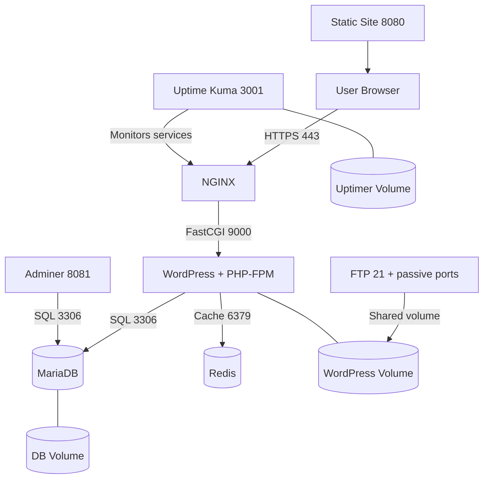

# Inception - Containerized Multi-Service Infrastructure

## Project Overview

This project is a complete Docker-based infrastructure built for the 42 Inception curriculum.  
It deploys a production-style stack around WordPress, fronted by NGINX over TLS, backed by MariaDB, and extended with practical bonus services (Redis cache, FTP, Adminer, static site, and Uptime Kuma).

The goal was to learn more than just "how to run containers": it was about designing a reproducible, isolated, and maintainable environment where multiple services communicate through Docker networking and persistent volumes.

---

## Why This Project Matters

- Builds **real infrastructure thinking** (not only app coding)
- Demonstrates **service orchestration** with `docker-compose`
- Applies **security basics** (TLS, isolated internal services, no direct DB exposure)
- Uses **persistent bind-backed volumes** for stateful data
- Shows **automation mindset** via startup scripts and `Makefile` workflows

---

## Architecture



### Service Topology

```mermaid
graph LR
    subgraph Docker Network: inception (bridge)
        NGINX
        WP[WordPress]
        DB[MariaDB]
        R[Redis]
        A[Adminer]
        F[FTP]
        S[Static]
        K[Uptime Kuma]
    end
```

---

## Tech Stack

- **Base OS**: Debian Bullseye images
- **Reverse Proxy / TLS**: NGINX + OpenSSL self-signed cert
- **Application**: WordPress + PHP-FPM 7.4 + WP-CLI
- **Database**: MariaDB
- **Caching**: Redis + `redis-cache` WordPress plugin
- **Ops/Tools (bonus)**: FTP (vsftpd), Adminer, Uptime Kuma, static site (lighttpd)
- **Orchestration**: Docker Compose
- **Automation**: shell bootstrap scripts + `Makefile`

---

## Repository Structure

```text
.
├── knowledge/
│   └── Docker Big Data.md
└── project/
    ├── Makefile
    ├── host_file.txt
    └── srcs/
        ├── docker-compose.yml
        ├── .env
        └── requirements/
            ├── nginx/
            ├── wordpress/
            ├── mariadb/
            └── bonus/
                ├── redis/
                ├── ftp/
                ├── adminer/
                ├── static/
                └── uptimer/
```

---

## Core Services Explained

### NGINX
- Exposes only `443` to host
- Generates certificate at container start
- Terminates TLS and forwards PHP to `wordpress:9000`
- Enforces modern TLS protocol (`TLSv1.3`)

### WordPress + PHP-FPM
- Waits for MariaDB readiness before provisioning
- Installs WordPress via WP-CLI
- Creates admin and standard user automatically
- Enables Redis object caching for performance

### MariaDB
- Initializes DB and users from environment variables
- Grants scoped DB permissions and root remote auth inside internal network
- Uses mounted data directory to persist state

---

## Bonus Services (Practical Value)

- **Redis**: reduces repeated database lookups by object caching
- **FTP**: allows file operations on mounted WordPress content
- **Adminer**: quick DB inspection/debug endpoint
- **Static site**: demonstrates additional independent HTTP service
- **Uptime Kuma**: service monitoring dashboard and availability checks

---

## How To Run

## 1) Host mapping
Add your domain to `/etc/hosts` (adapt username/domain as needed):

```bash
127.0.0.1 soujaour.42.fr
```

## 2) Configure environment variables
Edit:

`project/srcs/.env`

Use strong credentials in your local setup.

## 3) Start stack

```bash
cd project
make all
```

This creates local data directories and starts all services with rebuild.

## 4) Useful commands

```bash
make up
make stop
make down
make restart
make re
make clean
make fclean
```

---

## Exposed Endpoints

- `https://soujaour.42.fr` -> NGINX + WordPress
- `http://localhost:8080` -> Static site
- `http://localhost:8081` -> Adminer
- `http://localhost:3001` -> Uptime Kuma
- `ftp://localhost:21` -> FTP access

---

## What I Learned

- How Linux containers rely on **cgroups + namespaces** for isolation
- Difference between **build-time layers** and **run-time process behavior**
- How to design **single-responsibility containers** and still compose a full platform
- How to sequence startup safely (DB readiness checks before app init)
- Why persistence must be explicit (bind/volume strategy)
- How service-level caching (Redis) changes application behavior and load

The notes in `knowledge/Docker Big Data.md` helped ground these concepts from theory to implementation.

---

## Difficulties and How I Solved Them

- **Service startup ordering**  
  `depends_on` alone does not guarantee readiness. I implemented explicit DB health polling with `mysqladmin ping` in WordPress bootstrap.

- **Stateful services in ephemeral containers**  
  Containers are disposable, but DB/content are not. I used host-mounted volumes for MariaDB and WordPress to persist data across rebuilds.

- **TLS in local development**  
  Browsers and tooling can be strict with HTTPS. I generated certificates automatically inside the NGINX container and standardized host/domain mapping.

- **Cross-service communication**  
  Internal DNS names (`mariadb`, `redis`, `wordpress`) through one bridge network simplified service discovery and reduced hardcoded IPs.

- **Operational visibility**  
  Added Uptime Kuma to monitor uptime and improve debugging speed when services fail.

---

## Optimization Choices

- Enabled **Redis object cache** in WordPress (`WP_CACHE`, Redis host/port config)
- Kept internal services unexposed where possible (DB and Redis via `expose`, not host `ports`)
- Used slim install patterns (`--no-install-recommends`, apt cache cleanup) to reduce image bloat
- Reused named volumes and deterministic scripts for faster, reproducible rebuilds

---

## Academic and Engineering Value

This project demonstrates understanding across:

- **Systems**: Linux process isolation primitives and service lifecycles
- **Networking**: reverse proxying, internal DNS, bridged networks, port mapping
- **Security**: HTTPS termination and reduced external attack surface
- **DevOps fundamentals**: Infrastructure as Code, reproducible environments, automation
- **Reliability thinking**: persistence, startup synchronization, monitoring

---

## Recruiter-Focused Highlights

- Built and orchestrated an 8-service containerized platform from scratch
- Implemented automated infrastructure provisioning via shell + Compose
- Integrated performance optimization (Redis) and observability (Uptime Kuma)
- Delivered a practical local environment that mirrors production concerns
- Strengthened end-to-end ownership: architecture, security, operations, and debugging

---

## Suggested Evidence To Add (Optional)

If you want this README to stand out even more, add screenshots in a future `docs/images/` folder:

- WordPress home over HTTPS
- Adminer connected to MariaDB
- Uptime Kuma dashboard with monitored services
- `docker compose ps` output showing healthy multi-service stack

Then embed them like:

```md

```

---

## Final Reflection

Inception was a shift from "writing code" to "engineering a platform."  
The most valuable outcome was learning to reason about service boundaries, data durability, startup dependencies, and operational reliability - skills that transfer directly to real backend and DevOps environments.
